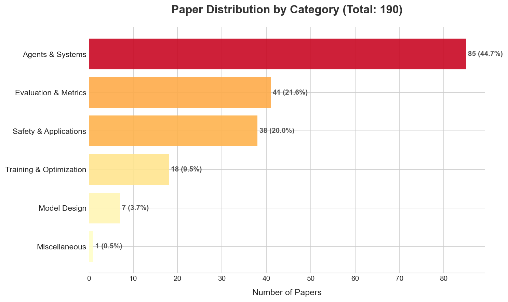

# Weekly AI Papers Digest
> **Date Range**: 2026-01-31 to 2026-02-07

**📅 Papers Published This Week:** 190

## 📊 Category Distribution

## 🚀 Top Breakthroughs (Top 3-5)
### [RRAttention: Dynamic Block Sparse Attention via Per-Head Round-Robin Shifts for Long-Context Inference](https://arxiv.org/abs/2602.05853)
**Category**: 🎨 Model Design  
**Takeaway**: Efficient long-context attention.  
- **Contribution**: Introduces a dynamic sparse attention mechanism using a round-robin sampling strategy that maintains query independence and enables global pattern discovery.  
- **Why it matters**: This method significantly reduces computational complexity for long-context inference in large language models while preserving performance.

### [Context Forcing: Consistent Autoregressive Video Generation with Long Context](https://arxiv.org/abs/2602.06028)
**Category**: 🏋️‍♂️ Training & Optimization  
**Takeaway**: Longer context, better consistency.  
- **Contribution**: Introduces Context Forcing, a framework that trains long-context video generation models using a long-context teacher to eliminate supervision mismatches.  
- **Why it matters**: This approach enables video generation with context lengths exceeding 20 seconds, significantly improving consistency over existing methods.

### [Reinforcement World Model Learning for LLM-based Agents](https://arxiv.org/abs/2602.05842)
**Category**: 🤖 Agents & Systems  
**Takeaway**: Enhanced LLMs through self-supervision.  
- **Contribution**: Introduces Reinforcement World Model Learning (RWML) for LLM-based agents to enhance action anticipation and environment adaptation through self-supervised world modeling.  
- **Why it matters**: This method improves LLM performance in agentic tasks by aligning internal simulations with real-world dynamics, addressing a critical gap in current LLM capabilities.

## 👓 Worth Skimming (Next 5-10)
### Model Design
- **[FiMI: A Domain-Specific Language Model for Indian Finance Ecosystem](https://arxiv.org/abs/2602.05794)**: Tailored model enhances performance in financial reasoning and tool-calling tasks specific to the Indian finance context.
- **[FMPose3D: monocular 3D pose estimation via flow matching](https://arxiv.org/abs/2602.05755)**: Novel generative framework reduces computational costs while improving accuracy in 3D pose estimation.
- **[Shiva-DiT: Residual-Based Differentiable Top-$k$ Selection for Efficient Diffusion Transformers](https://arxiv.org/abs/2602.05605)**: Balances differentiability and efficiency for Diffusion Transformers, enhancing computational performance.

### Training & Optimization
- **[Muon in Associative Memory Learning: Training Dynamics and Scaling Laws](https://arxiv.org/abs/2602.05725)**: Introduces the Muon optimizer, achieving exponential speedup in optimization, particularly in noisy environments.
- **[LongR: Unleashing Long-Context Reasoning via Reinforcement Learning with Dense Utility Rewards](https://arxiv.org/abs/2602.05758)**: Combines dynamic reasoning with contextual density rewards to enhance long-context reasoning in LLMs.
- **[TimelyFreeze: Adaptive Parameter Freezing Mechanism for Pipeline Parallelism](https://arxiv.org/abs/2602.05754)**: Optimizes training throughput and accuracy for large models through an adaptive parameter freezing mechanism.

### Agents & Systems
- **[V-Retrver: Evidence-Driven Agentic Reasoning for Universal Multimodal Retrieval](https://arxiv.org/abs/2602.06034)**: Enhances reasoning through active visual verification, improving retrieval accuracy.
- **[Weaver: End-to-End Agentic System Training for Video Interleaved Reasoning](https://arxiv.org/abs/2602.05829)**: Introduces a multimodal reasoning system that dynamically utilizes diverse tools for enhanced video reasoning.
- **[Beyond Manual Planning: Seating Allocation for Large Organizations](https://arxiv.org/abs/2602.05875)**: Automates seating allocation in organizations, improving efficiency in managing team proximities.

### Evaluation & Metrics
- **[AI chatbots versus human healthcare professionals: a systematic review and meta-analysis of empathy in patient care](https://arxiv.org/abs/2602.05628)**: Reveals that AI chatbots are often rated as more empathic than human healthcare professionals in text-based interactions.
- **[RISE-Video: Can Video Generators Decode Implicit World Rules?](https://arxiv.org/abs/2602.05986)**: Introduces a benchmark for evaluating generative video models based on reasoning capabilities rather than just visual fidelity.

## 📈 Trends of the Week
1. **Long-Context Capabilities**: Several papers focus on enhancing long-context reasoning and generation, indicating a growing emphasis on handling extended sequences in various applications.
2. **Adaptive Mechanisms**: The introduction of adaptive techniques in training and optimization highlights a trend towards improving efficiency and performance in model training.
3. **Empathy in AI**: The exploration of AI's empathetic capabilities, particularly in healthcare, suggests a shift towards integrating emotional intelligence in AI systems for better user interactions.
